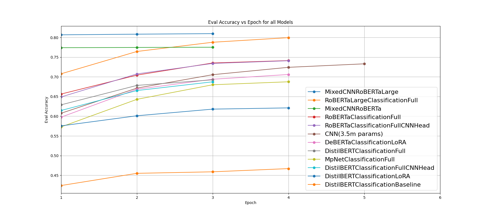
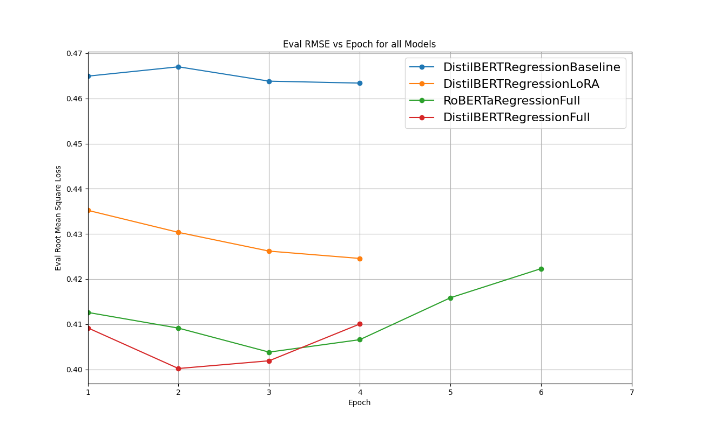
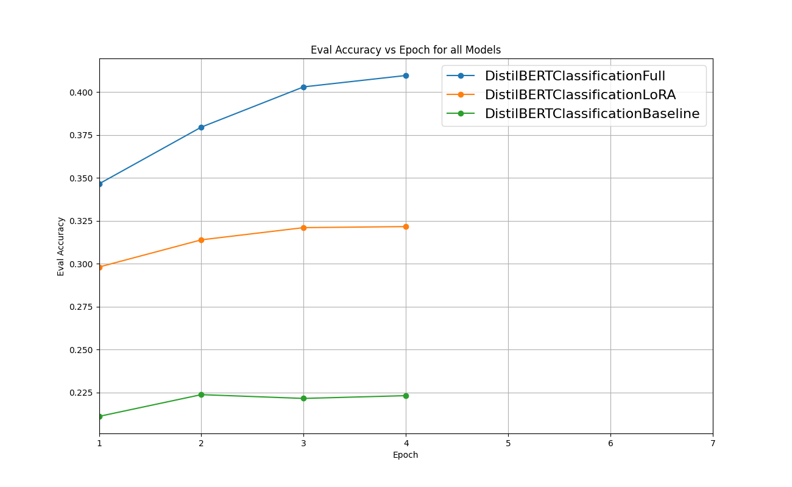

# Native Language Identification and Author Profiling

Project focused on recognition of individual traits based on English writing using transformers, convolutional neural networks and a combination of both.

---

## Table of Contents

* [Project Structure](#project-structure)
* [Data](#data)
* [Training](#training)
* [Testing & SHAP](#testing-shap)
* [Usage & Requirements](#usage-requirements)
* [Results](#results)
* [Screenshots](#screenshots)
* [License](#license)

---

## Project Structure

```
.
├── App/                   # How to run it yourself in a Nutshell
├── Assets/                # Images, Screenshots
├── ACCURACIES.md          # Summary of model evaluation results
├── Testing/               # Evaluation scripts, notebooks, and test runs of models
├── Training/              # Everything related to model training
└── README.md
```

### Training Folder

```
Training/
├── DATA/                       # Raw and preprocessed datasets
├── MODELS/                     # Trained model checkpoints organized by task
├── checkTokenDistribution.py   # See if dataset is balanced in token lenght
├── deparquetize.py             # Convert parquet datasets to other formats
├── parquetize.py               # Convert CSV/text datasets to parquet
└── README.md                   # Detailed description of datasets
```

### Models (Training/MODELS)

```
MODELS/
├── age
│   ├── DistilBERTRegressionBaseline
│   ├── DistilBERTRegressionFull
│   └── DistilBERTRegressionLoRa
├── gender
│   ├── DistilBERTClassificationFull
│   ├── DistilBERTRegressionBaseline
│   ├── DistilBERTRegressionFull
│   ├── DistilBERTRegressionLoRA
│   └── RoBERTaRegressionFull
├── language
│   ├── CNN
│   ├── DeBERTaClassificationLoRA
│   ├── DistilBERTClassificationBaseline
│   ├── DistilBERTClassificationFull
│   ├── DistilBERTClassificationFullCNNHead
│   ├── DistilBERTClassificationLoRA
│   ├── MpNetClassificationFull
│   ├── RoBERTaClassificationFull
│   ├── RoBERTaClassificationFullCNNHead
│   ├── RoBERTaLargeClassificationFull
│   ├── RoBERTaLargeMixedCNN
│   └── RoBERTaMixedCNN
├── mbti
│   ├── DistilBERTClassificationBaseline
│   ├── DistilBERTClassificationFull
│   └── DistilBERTClassificationLoRA
└── political
    ├── DistilBERTRegressionBaseline
    ├── DistilBERTRegressionFull
    ├── DistilBERTRegressionFullLongText
    ├── DistilBERTRegressionFullRawLogits
    └── DistilBERTRegressionLoRA
```

Organized by prediction task:

* **Age**: Regression models using DistilBERT variants
* **Gender**: Classification and regression model
* **Language**: Various classification methods including CNNs, Transformers (DistilBERT, RoBERTa, DeBERTa, MpNet) and mixed ( CNN + RoBERTa ...)
* **MBTI**: Classification models using DistilBERT
* **Political Orientation**: Regression models using DistilBERT

---

### Testing Folder

```
Testing/
├── accuracy.ipynb         # Notebook for computing evaluation metrics
├── RUNS/                  # Results from previous runs per task
├── shap/                  # Scripts and notebooks for SHAP explainability
└── TODO.md
```

* SHAP scripts allow per-model testing of actual performance
* Each subfolder under `RUNS/` corresponds to a task like `age`, `gender`, `language`, etc.

---

## Data

* Stored in `Training/DATA` in parquet format.
* Preprocessing scripts in `Training/` handle tokenization, masking, and format conversion.
* Tasks are as follows:

  * Age prediction (regression based)
  * Gender prediction (regression based)
  * Language classification
  * MBTI type classification
  * Political orientation prediction (regression based)

---

## Training

* Models are organized by task in `Training/MODELS`.
* Pretrained or baseline versions are available alongside LoRA/finetuned variants.

---

## Testing SHAP

* Use `Testing/shap/run.ipynb` to evaluate model predictions using SHAP.
* Old run results stored in `Testing/RUNS/<task>/<run>.ipynb` as reference.

---

## Usage Requirements

* `App/` folder contains the scripts neccesary to train and run recommended models when cloning this repository.
* This code allows users to play around with our project without diving to deep in the technicals.

* Overall system requirements aside from a decent GPU are as follows:
```
Python >= 3.10
PyTorch (torch) with CUDA support
CUDA toolkit
Transformers (Hugging Face)
Pandas
NumPy
scikit-learn
spaCy
SHAP
tqdm
Matplotlib (for plotting)
Jupyter Notebook (optional, for notebooks)
```

---

## Results

* Here we present a visual summary of the model evaluation across different tasks. Each plot shows performance metrics (e.g., accuracy, Root Mean Squared Error) for the corresponding task.

| Language Classification|
|------------------------|
||

| Gender Prediction | Age Prediction |
|------------------------|----------------|
| |  |

| Political Orientation | MBTI Classification |
|-----------------|-------------------|
|  |  |


---

## Screenshots

* Here we show some screenshots of the working prediction models:

| Screenshots|
|------------------------|
||
|------------------------|
||
|------------------------|
||

---

## License

Maybe in the future
